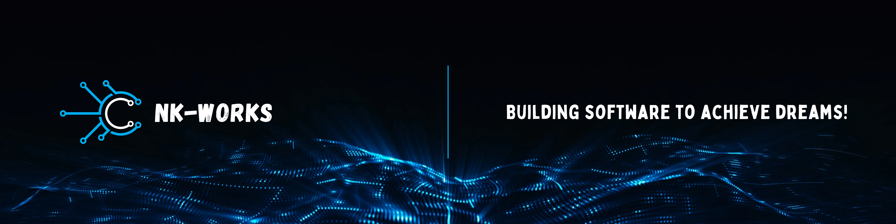
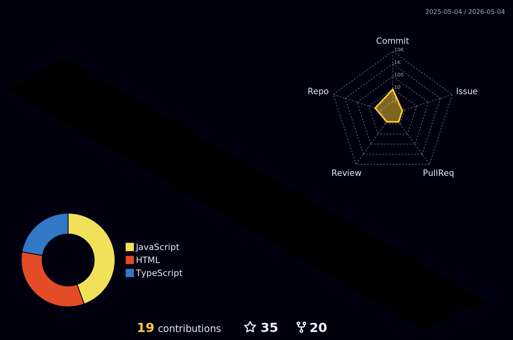

<!-- For this profile template, I would like to express my gratitude to https://github.com/walidbosso -->
<!--  -->
<!-- Intro Statement -->

## Hey <𝚌𝚘𝚍𝚎𝚛/>! Nice to see you  

<!-- Banner -->

 

    

 

<!-- Quote -->

<h3 align="center"> 
     
    
    "Talk is cheap. Show me the code." - Linus Torvalds  
     
</h3>

<!--  -->

<!-- Name -->
<h2 align="center"> 
    <a> Hello Contributor! 
         
            I am Anneshu Nag 
    </a> 
</h2>

<!-- Bio -->

### Congratulations! You found me :)

- 👨‍💻 I'm a versatile software developer with experience in **`Node.js`, `.NET Core`, `React`, `IoT`**, and more.
- 🎓 Cruising through my 3rd year at **Chitkara University in Punjab, India**—where learning meets adventure!
- 📚 Currently diving into **`Jenkins`, `Generative AI`, and `React Native`** to expand my skills! 😅
- 💪🏼 My future goals? Mastering **`Deep Machine Learning`** to turn ambitious ideas into powerful software solutions.
- ⚡ **Building software to achieve dreams!**

<!-- Contact Info -->

### Contact me:

    
    
    
    
    
    
    
   
    

<!--Skills-->

<h3 align="center">
    
    
    【Ｓｋｉｌｌｓ】  
</h3>

 
  

| **Programming_Languages**                           | **Frontend_Tools**                                      | **Backend_Tools**                                       | **Data_Related**                                      | **IDEs/Softwares**                                           | **Other_Tools**                                    |
| --------------------------------------------------- | -------------------------------------------------- | -------------------------------------------------- | -------------------------------------------------- | ---------------------------------------------------- | -------------------------------------------------- |
| 
 
| 
  
| 
 | 
 |
  |  
  |
| 
 | 
 | 
 | 
  |
  | 
  |
| 
 | 
  | 
 |  
 | 
 |
   |
| 
 | 
 |
  |
                                                  |
  | 
  |
<!-- | 
 | 
 | 
 |  
  |
  |
   |
| 
 |
 |
  | 
  | 
  | 
                                                  |                                            |
| 
 |
 | 
 | 
    |  
       |  
  |    -->

<!-- 

 -->

<!--STATS-->

<h3 align="center">
     
     
    【Ｓｔａｔｓ】 
</h3>

 

    
     

<!--More Stats-->

    
📈 More Stats

     
 

    

    

        <a href="https://github.com/NK-Works"> 
             
              
            
            
              
              
        </a>
        <a href="https://github.com/NK-Works"> 
          
  </a> 
  
   
  
 

<!--SNAKE-->

<!--My REPOSITORIES-->

  
📁 My Repositories

   
  

<!--  -->
<!--  -->

### Show some 💙 by starring ⭐ some of the repositories!
 

<!-- Open Source Contibutions -->

<h3 align="center">
     
    
    【 O p e n - S o u r c e 】  
</h3>

 

<!-- GSSoC -->
 

  <table>
    <tr align="center">
      <td style="border-right: 1px solid #dddddd; padding: 15px;" valign="top" width="50%">
        <h>
          
           
          <strong>GirlScript Summer of Code</strong>
        </h>
         
        🏅 <strong>Ranked 45th</strong>
         
        ⎯⎯⎯⎯⎯⎯⎯⎯⎯⎯⎯⎯⎯⎯⎯⎯⎯⎯⎯⎯⎯⎯⎯⎯⎯
        

            Out of <strong> 60,000+ </strong> participants 
            PRs Merged: <strong> 62+ </strong> 
            Total Badges: <strong> 8 </strong> 
            Total Score: <strong> 2260 </strong>
        

      </td>
      <td style="padding: 15px;" valign="top" width="50%">
        <table height="100%">
          <tr align="center" height="50%">
            <td style="border-right: 1px solid #dddddd; padding: 10px;" width="120">
              
               
              <strong>Explorer Badge</strong>
            </td>
            <td style="border-right: 1px solid #dddddd; padding: 10px;" width="120">
              
               
              <strong>Adventurer Badge</strong>
            </td>
            <td style="border-right: 1px solid #dddddd; padding: 10px;" width="120">
              
               
              <strong>Champion Badge</strong>
            </td>
            <td style="padding: 10px;" width="120">
              
               
              <strong>Trailblazer Badge</strong>
            </td>
          </tr>
          <tr align="center" height="50%">
            <td style="border-right: 1px solid #dddddd; padding: 10px;" width="120">
              
               
              <strong>Summit Badge</strong>
            </td>
            <td style="border-right: 1px solid #dddddd; padding: 10px;" width="120">
              
               
              <strong>Innovator Badge</strong>
            </td>
            <td style="border-right: 1px solid #dddddd; padding: 10px;" width="120">
              
               
              <strong>Hack-Web3Conf</strong>
            </td>
            <td style="padding: 10px;" width="120">
              
               
              <strong>Postman API Expert</strong>
               
            </td>
          </tr>
        </table>
      </td>
    </tr>
  </table>

<!-- Hobbies -->

<h3 align="center">
    
    
    【H o b b i e s】  
</h3>

<h3 align="center">
    📚 Coding💻 and Reading Web Novels!
    
</h3>

<!--QUOTE-->

<!--End-->
<a href="https://github.com/NK-Works"> 
  
<a href="https://github.com/NK-Works"> 
  

<!--THANKS-->
 

<a href="./assets/images/GooglePay_QR.png">
 
</a>

  

